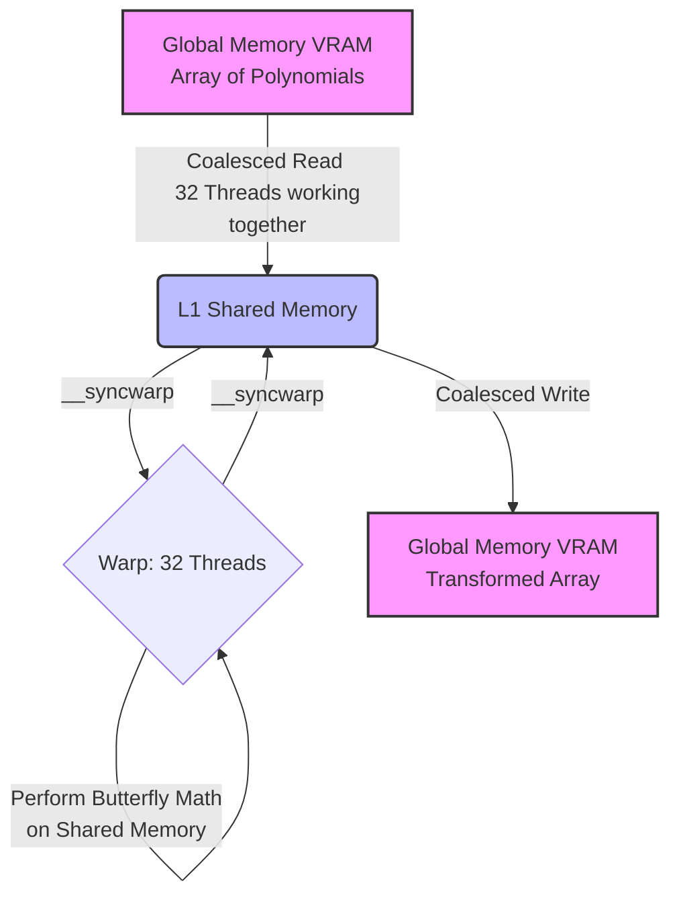

# HI-Kyber GPU Implementation

## Overview

This repository/notebook contains a CUDA-accelerated implementation of key components of the **Kyber** key encapsulation mechanism (KEM), which is a core part of the NIST post-quantum cryptographic standards (FIPS 203).

Specifically, it demonstrates how to take the heavy mathematical lifting of lattice-based cryptography and offload it to a GPU, achieving massive parallelization. This implementation heavily relies on advanced GPU memory management and parallel reduction techniques to achieve high throughput.

## What is in the Code?

The notebook implements four major distinct operations of the Kyber algorithm using CUDA C++:

### 1. The Number Theoretic Transform (NTT) Kernel
* **What it does:** NTT is a specialized form of the Fast Fourier Transform (FFT) used to multiply polynomials over a finite field very quickly. This is the single most expensive operation in Kyber.
* **How it works:** The code implements an "EDFS-NTT" (Explicitly Distributed Frequency Space NTT). Instead of forcing one GPU thread to process an entire mathematical polynomial (which causes slow register spilling), it uses **Sliced Layer Merging (SLM)**. A whole block of 32 threads (a "Warp") works *together* to load a polynomial into blazing-fast L1 Shared Memory, perform the complex math in parallel, and write it back.
* **Validation:** It runs a CPU reference implementation and compares the outputs to ensure the GPU math is 100% cryptographically correct. It then benchmarks processing 1,000,000 polynomials to show the massive speedup of the GPU.

### 2. Pointwise Multiplication (`BaseMul`)
* **What it does:** Once elements are in the "frequency domain" (after the NTT), you multiply them together point-by-point. Because Kyber operates on specialized rings, this isn't a simple scalar multiplication; it requires complex modular arithmetic (using Montgomery reductions) and twiddle factors (`zetas`).
* **Validation:** The kernel takes two polynomials, multiplies them, and compares the output with a reference CPU function to guarantee accuracy.

### 3. Inverse Number Theoretic Transform (INTT)
* **What it does:** The exact reverse of the NTT. Once the polynomials are multiplied together in the frequency domain, they must be converted back to the standard positional domain.
* **How it works:** Like the NTT, it maps the complex Cooley-Tukey butterfly operations to warps and shared memory to maintain high bandwidth.

### 4. Encode and Decode (Compression)
* **What it does:** In Kyber, polynomials consist of 256 coefficients that easily fit into 12-bit numbers. But computers transmit data in 8-bit bytes. This kernel safely and densely packs every two 12-bit numbers into three 8-bit bytes (reducing 512 bytes down to 384 bytes) and unpacks them.
* **How variables are packed (Encode):**
  We map each pair of 12-bit coefficients ($t_0$ and $t_1$) into three 8-bit bytes.
  ```text
  t0 (12 bits) = [ C B A 9 8 7 6 5 4 3 2 1 ]
  t1 (12 bits) = [ X W V U T S R Q P O N M ]

  Byte 0 = Lower 8 bits of t0
           [8 7 6 5 4 3 2 1]
  Byte 1 = Upper 4 bits of t0 + Lower 4 bits of t1
           [P O N M C B A 9]
  Byte 2 = Upper 8 bits of t1
           [X W V U T S R Q]
  ```
  This is processed massively in parallel where multiple threads process distinct pairs of coefficients independently.
* **How variables are unpacked (Decode):**
  The reverse process occurs. A thread grabs 3 bytes of raw data, reconstructs the integer bitwise, masks off extraneous bits (`& 0xFFF`), and dumps the results back into a 16-bit integer array.
* **Demonstration:** To prove this works, the code takes a secret text string (`"Hello Kyber! ..."`), converts the characters into polynomial coefficients, "Encrypts" (encodes) them down to raw bytes, and then "Decrypts" (decodes) them back to polynomial coefficients to smoothly reconstruct the string. 

## Deep Dive: GPU Architecture & Operations

### How Shared Memory is Accessed (EDFS-NTT)
A major bottleneck in standard Kyber GPU implementations is **Register Spilling**. If one thread tries to hold an entire 256-element polynomial (with its loops and parameters), the GPU runs out of fast registers and pushes the data to slow local memory. 

We solve this using **Sliced Layer Merging (SLM)** and **Shared Memory**.
1. **Coalesced Load:** A Warp (32 threads) works together. Instead of thread 0 grabbing all 256 elements, all 32 threads stagger their reads. Thread 0 grabs element 0, thread 1 grabs element 1, etc., up to element 31. Then they loop to grab elements 32-63. This ensures memory requests are grouped (coalesced), allowing the L2 Cache to serve data at maximum speed.
2. **Shared Memory Staging:** The 256 elements are placed into block-level `__shared__` memory. This memory is nearly as fast as registers but can safely hold the entire polynomial without spilling.
3. **Collective Computation (The Butterfly):** The 32 threads now distribute the Cooley-Tukey butterfly operations across the data in Shared Memory, using `__syncwarp()` to ensure no thread races ahead of the math.
4. **Coalesced Store:** The warp collectively writes the completed 256-element polynomial back out to VRAM.



## What We Achieve

1. **Post-Quantum Cryptography Readiness:** We have implemented the hardest mathematical primitives required to build quantum-resistant encryption.
2. **High Throughput GPU Offloading:** We have proved that by using Warp-level programming and Shared-Memory optimization, we can bypass the register-pressure bottlenecks that usually hinder cryptography on GPUs.
3. **Accuracy via Validation:** The notebook directly pairs highly-optimized parallel GPU algorithms with slow, standard CPU reference designs to prove that zero cryptographic accuracy is lost in exchange for this speed.
4. **Verifiable Results:** By running the cells, users can view exact performance benchmarks (Kops/s) and visual text-based proofs showing data encoding and point-multiplying successfully.

## Tuning & Future Optimizations

While this implementation achieves excellent throughput via Shared Memory and Warp-synchronous programming, there is a ceiling you can hit on standard datacenter GPUs. To push latency into the sub-millisecond range for millions of keys, consider these tuning steps:

### 1. Transposing Global Memory (Perfect Coalescing)
Right now, `warp 0` reads elements `0..255`, and `warp 1` reads elements `256..511`. 
* **The Goal:** Restructure the global VRAM array so it is stored in "Struct of Arrays" (SoA) format. 
* **The Result:** Thread 0 of Warp 0 grabs `index 0`. Thread 0 of Warp 1 grabs `index 1`. The GPU memory bus can fulfill requests much faster when sequential warps grab sequential memory addresses.

### 2. Fine-grained SDFS/EDFS
Currently, our threads are mapping loops over the polynomial. Advanced implementations completely unroll the NTT butterfly network dynamically at compile time via template metaprogramming, assigning exact VRAM addresses to exact registers and bypassing Shared Memory synchronization entirely.

### 3. Fusing Pointwise Multiplication
Right now we do: 
1. NTT `kernel<<<>>>` -> VRAM
2. Pointwise `kernel<<<>>>` -> VRAM
3. INTT `kernel<<<>>>` -> VRAM

* **The Fix:** Because NTT, Pointwise, and INTT all map perfectly to the 256-element polynomial structure, you can merge them into a single Mega-Kernel. Read from VRAM once, do all three math steps in VRAM cache/registers, and write back once. This eliminates the bandwidth bottleneck of constantly moving data on and off the core.